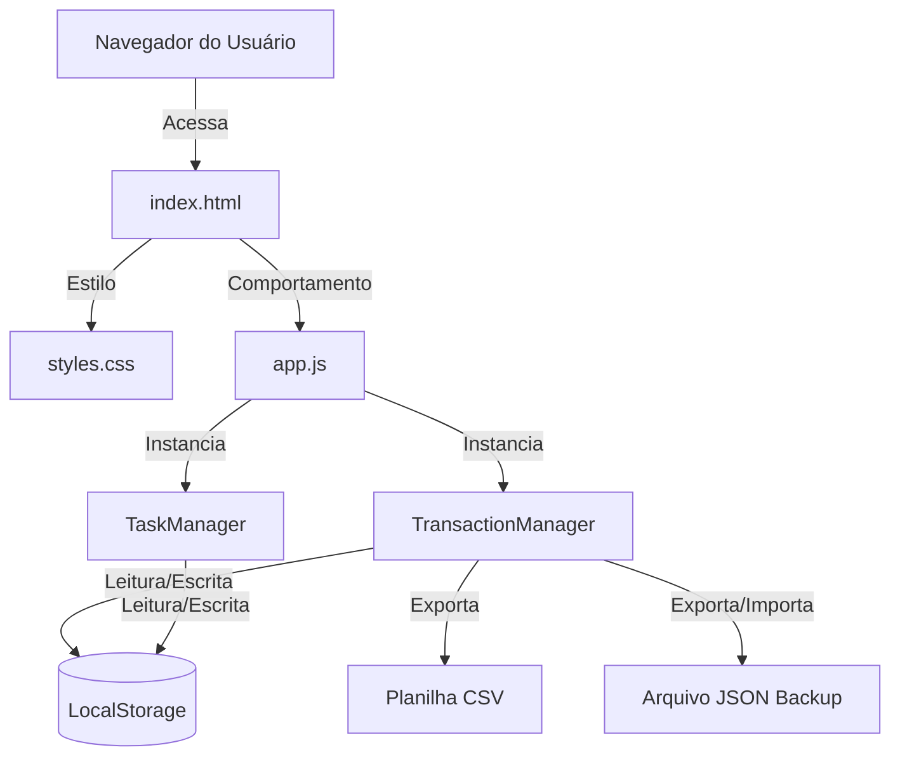

# Arquitetura do Sistema - Controle Renda Extra (Renda+)

Esta seção detalha o fluxo de dados e os componentes técnicos da aplicação.

## Visão Geral da Arquitetura

O sistema é uma aplicação SPA (Single Page Application) construída em **Vanilla HTML5, CSS3 e JavaScript (ES6+)**, sem frameworks pesados, garantindo performance instantânea e facilidade de deploy.

## Componentes do Sistema

1. **TransactionManager (`app.js`)**:
   - Gerencia lançamentos financeiros (serviços, vendas de peças e outras rendas).
   - Realiza o cálculo dinâmico da reserva marginal de imposto com base no salário fixo CLT/base e na tabela progressiva mensal do IRPF.
   - Trata de exportações em formato CSV e backups em JSON.

2. **TaskManager (`app.js`)**:
   - Gerencia uma lista simples de tarefas ou metas de renda extra locais.
   - Armazena as tarefas no `localStorage` sob a chave `tasks`.

3. **Interface Gráfica (`index.html` & `styles.css`)**:
   - Layout responsivo adaptado para dispositivos móveis e desktops.
   - Estética premium com suporte a gradientes HSL, sombras suaves e componentes semânticos.

## Fluxo de Dados e Persistência
Toda a persistência é mantida estritamente no lado do cliente (Client-Side) utilizando `localStorage`. Isso assegura:
- **Zero custo de servidor:** O aplicativo pode ser hospedado de graça em plataformas como GitHub Pages.
- **Privacidade total:** Nenhum dado financeiro transita pela rede ou por servidores de terceiros.
